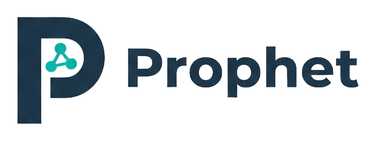

<p align="center">
  
</p>

---

## Overview

An [ontology](https://en.wikipedia.org/wiki/Ontology_(information_science)) is a formal description of a domain. It defines what things exist, what they are called, what data they carry, and how they relate to each other.

In business terms, an ontology is a shared language for the company. It answers basic but critical questions. What is an order? When is an order approved? What makes a customer active? Which fields are required for a shipment? If different systems answer those questions differently, teams move slower and errors multiply.

Prophet was built to make that shared language explicit. It lets teams drive engineering from the real-world business models of the organization, then generate consistent backend scaffolding from that definition.

## What is Prophet?

Most organizations eventually duplicate the same business model across many places. It gets rewritten in [API contracts](https://en.wikipedia.org/wiki/API), [database schemas](https://en.wikipedia.org/wiki/Database_schema), service code, validation logic, and event payloads. Each copy starts correct. Over time, the copies drift.

Prophet treats that as a modeling problem, not just a coding problem. You define the domain as an ontology, and Prophet projects that model into the repetitive integration layer around it. APIs, schema artifacts, runtime contracts, and framework wiring come from one source instead of being hand-maintained in parallel.

The result is not a rigid platform. Teams can stay polyglot and still keep one coherent domain model across Java, Node, and Python services.

## Why This Matters for Systems Engineering

Reliability problems in large systems often begin as language problems. Team A uses one definition. Team B uses another. Both are reasonable on their own, but the integration breaks.

Prophet helps by giving those boundaries a common contract. Generated outputs stay aligned because they are derived from the same ontology, not maintained by hand in parallel.

That also changes how teams approach change. When the domain evolves, the impact can be reasoned about clearly instead of discovered late.

### From Scaffolding to Coordination

A core value proposition is speed from a minimal model. A small domain DSL can generate most of the scaffolding and wiring that teams usually build by hand: contracts, routes, schema artifacts, and framework integration surfaces. That removes a large amount of repetitive setup work at the start of a project.

The longer-term value is coordination. As systems grow, teams make many local changes that can drift into one global mismatch. Prophet addresses that by encoding domain meaning, not just table shape, so actions, events, queries, and persistence evolve together. You get faster initial delivery and a model that stays understandable over time.

## What Prophet Generates

From a `.prophet` ontology file, Prophet can generate:
- SQL schema files
- OpenAPI contracts
- Turtle ontology projections (`gen/turtle/ontology.ttl`)
- Spring Boot integration code (DTOs, JPA entities/repositories, query and action endpoints)
- Node/Express integration code (typed contracts, zod validation, action/query routes, event publisher contracts)
- Python integration code (typed dataclass contracts, action/query routes, event publisher contracts)
- Event publisher wire envelopes with optional extracted object snapshots (`updated_objects` / `updatedObjects`) from ref-normalized event payloads
- Prisma schema + repository adapters for Node targets
- TypeORM entities + repository adapters for Node targets (wired through your application-owned `DataSource`)
- Mongoose models + repository adapters for Node targets (wired through your application-owned Mongoose connection)
- SQLAlchemy adapters + models for Python targets
- SQLModel adapters + models for Python targets
- Django adapters + models for Python targets
- Flyway/Liquibase migration artifacts
- Generation manifests for ownership and extension hooks

Turtle target conformance notes:
- Uses `prophet:` vocabulary from `prophet.ttl`
- Uses a local prefix derived from ontology name (not a hardcoded `example` prefix)
- Supports SHACL validation via `pyshacl` against `prophet.ttl`

## How Prophet Is Used

1. Define your business domain in Prophet DSL.
2. Run validation.
3. Generate artifacts.
4. Add your business logic in user-owned extension points.
5. Evolve safely with compatibility/version checks.

## Install

From PyPI:

```bash
python3 -m pip install --upgrade prophet-cli
prophet --help
```

From source (editable install):

```bash
python3 -m venv .venv --system-site-packages
.venv/bin/pip install --no-build-isolation -e ./prophet-cli
```

## Get Started

- Quickstart overview: [Quickstart](docs/quickstart/quickstart.md)
- Java quickstart: [Spring + JPA](docs/quickstart/java.md)
- Node quickstart: [Express](docs/quickstart/node.md)
- Python quickstart: [FastAPI / Flask / Django](docs/quickstart/python.md)
- Turtle target reference: [Turtle](docs/reference/turtle.md)
- Minimal Turtle example: [examples/turtle/prophet_example_turtle_minimal](examples/turtle/prophet_example_turtle_minimal)
- Runnable sample apps: [Examples](docs/reference/examples.md)
- Full user reference: [Reference Index](docs/reference/index.md)
- Developer docs: [Developer Index](docs/developer/index.md)

## Supported Stacks

| Language | Framework | ORM/Adapter | Stack ID | Example |
| --- | --- | --- | --- | --- |
| Java | Spring Boot | JPA | `java_spring_jpa` | [Spring Example](examples/java/prophet_example_spring) |
| Node | Express | Prisma | `node_express_prisma` | [Express + Prisma Example](examples/node/prophet_example_express_prisma) |
| Node | Express | TypeORM | `node_express_typeorm` | [Express + TypeORM Example](examples/node/prophet_example_express_typeorm) |
| Node | Express | Mongoose | `node_express_mongoose` | [Express + Mongoose Example](examples/node/prophet_example_express_mongoose) |
| Python | FastAPI | SQLAlchemy | `python_fastapi_sqlalchemy` | [FastAPI + SQLAlchemy Example](examples/python/prophet_example_fastapi_sqlalchemy) |
| Python | FastAPI | SQLModel | `python_fastapi_sqlmodel` | [FastAPI + SQLModel Example](examples/python/prophet_example_fastapi_sqlmodel) |
| Python | Flask | SQLAlchemy | `python_flask_sqlalchemy` | [Flask + SQLAlchemy Example](examples/python/prophet_example_flask_sqlalchemy) |
| Python | Flask | SQLModel | `python_flask_sqlmodel` | [Flask + SQLModel Example](examples/python/prophet_example_flask_sqlmodel) |
| Python | Django | Django ORM | `python_django_django_orm` | [Django + Django ORM Example](examples/python/prophet_example_django) |

Minimal Turtle sample project:
- [examples/turtle/prophet_example_turtle_minimal](examples/turtle/prophet_example_turtle_minimal)

## License

Apache-2.0. See [LICENSE](LICENSE).
